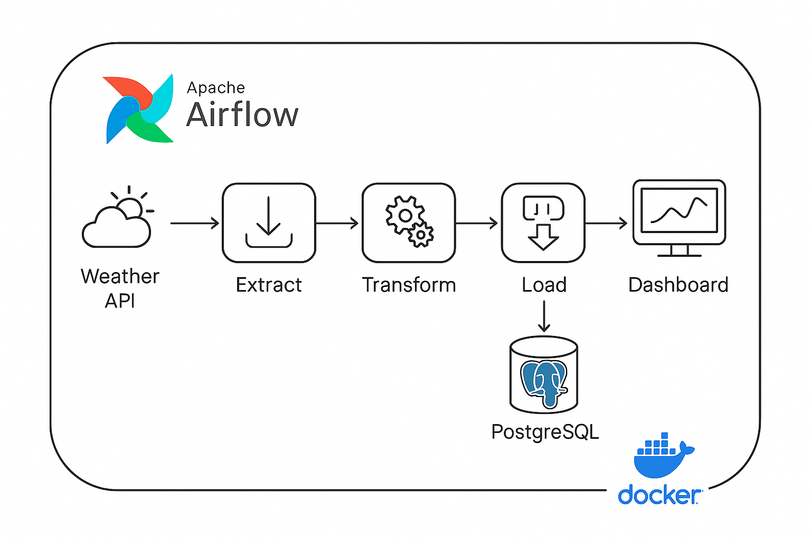

# 🌤️ Weather ETL Pipeline avec Airflow, PostgreSQL et Streamlit

Ce projet consiste en un pipeline ETL (Extract, Transform, Load) automatisé par Airflow pour récupérer des données 
météorologiques via une API, les transformer, puis les stocker dans une base de données PostgreSQL. Une interface Streamlit
permet de visualiser les données collectées sous forme graphique.

---

## 🚀 Objectifs du projet

- Automatiser la récupération quotidienne de données météo.
- Transformer et nettoyer les données récupérées.
- Stocker efficacement ces données dans PostgreSQL.
- Fournir une interface interactive pour visualiser les résultats avec Streamlit.

---

## 🛠️ Technologies utilisées

- **Python**
- **Airflow** (Orchestration)
- **PostgreSQL** (Base de données)
- **Docker Compose** (Conteneurisation)
- **Streamlit** (Dashboard interactif)

---

## 📂 Structure du projet

```bash
project/
├── dags/
│   └── etl_pipeline.py          # DAG Airflow
├── app/
│   └── main.py                  # Dashboard Streamlit
├── docker-compose.yml           # Configuration Docker
├── requirements.txt             # 
└── logs/                        # Logs Airflow
```


---

## 🗺️ Architecture du pipeline

Voici une vue d'ensemble du pipeline de données météo automatisé :



- **API Météo** : Source des données météo quotidiennes
- **Airflow** : Orchestration des étapes Extract → Transform → Load
- **PostgreSQL** : Stockage structuré des données
- **Streamlit** : Visualisation des données météo
- **Docker Compose** : Conteneurisation et déploiement local

---


## ⚙️ Installation

### 1. Cloner le dépôt

```bash
git clone <URL_GITHUB>
cd project
```

### 2. Lancer l'environnement avec Docker Compose

```bash
docker-compose up --build -d
```

### 3. Accéder aux services

- Airflow Webserver: [http://localhost:8080](http://localhost:8080)
  - **Utilisateur:** `admin` / **Mot de passe:** `admin`

- Dashboard Streamlit: [http://localhost:8501](http://localhost:8501)

- PostgreSQL:
  - **Host:** `localhost`
  - **Port:** `5432`
  - **Utilisateur:** `airflow`
  - **Mot de passe:** `airflow`
  - **Base de données:** `airflow`

---

## 📈 Utilisation

Le DAG Airflow nommé `etl_pipeline` s'exécute quotidiennement et effectue les tâches suivantes :

- **Extraction** des données depuis l'API météo (Open-Meteo).
- **Transformation** des données extraites en format approprié pour la base de données.
- **Chargement** des données transformées dans PostgreSQL.

Le Dashboard Streamlit affiche :
- Un tableau avec les données météo (températures min/max, précipitations, etc.).
- Un graphique montrant l'évolution quotidienne des températures et précipitations.

---

## 📌 Exemples de visuels

*Capture d'écran du dashboard Streamlit
 .*

---

## ⚠️ Points à améliorer

- Gestion d'erreurs complète (API indisponible, connexion DB).
- Ajout d'un système de monitoring (logs avancés, alertes).
- Déploiement cloud pour simuler un environnement de production réel.

---

## 💡 Auteur

- **Almountassir Abdel-aziz** – 

---

🎯 **Next steps** : intégration d'un modèle ML pour prédire les données météo futures ! 🚀

